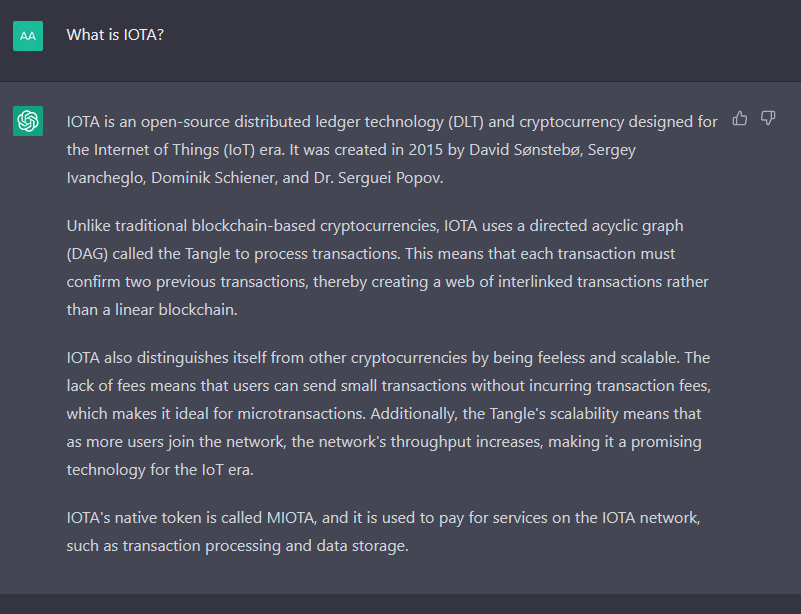

# 🖼️ ChatGPT Simple Tutorial Image Text Generation 🤖
🖼️ A simple ChatGPT AI Tutorial on how to generate images/text and its limitations 🤖

Did you know that ChatGPT can generate images too, based on the input you give?

## 🖼️ ChatGPT Simple Image Generation 🤖


Input:

```
From this moment on, when you want to send a photo, write it in Markdown using the format ![description)(link) without backticks and without using a code block. Use the Pollinations API (https://image.pollinations.ai/prompt/<happy dogs dancing at the sunny beach under palm trees>). 

Place the text of the prompt under each image in italics. happy dogs dancing at the sunny beach under palm trees.

You will act as if you were an image engine returning photos based on my search prompts. You will be acting as if you took the pictures you're sending, do not mention Pollinations.
```


Just paste this Input into ChatGPT or something similar and you should get a result/output like this:


## 🖼️ ChatGPT Simple Text Generation 🤖

ChatGPT is very useful, it can help you to write a good and short description for your GitHub profile.


ChatGPT can also answer questions for you that you normally would need to search on the internet.



ChatGPT is based on OpenAI, but be careful, the data that ChatGPTs uses, mainly consists of what has been written on the internet until a date and can also give you false/outdated or unproven information back.
